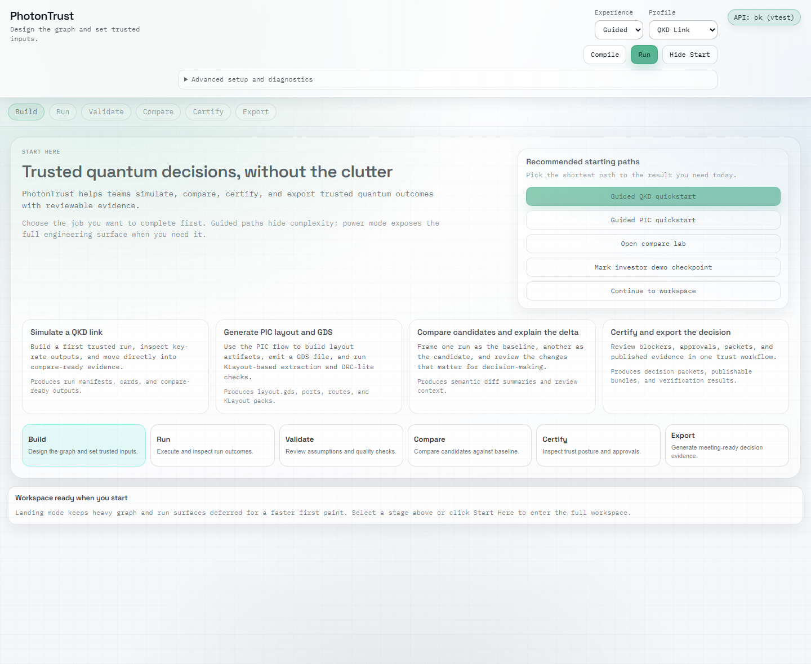
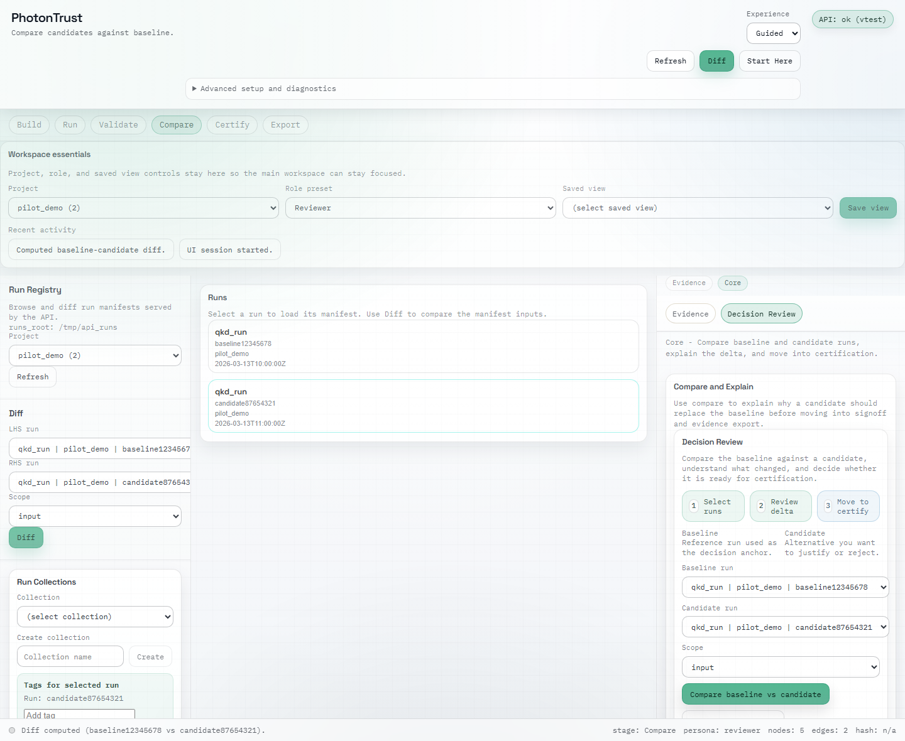

# Product UI Walkthrough

This page covers the maintained local React product path.

## Start the Local Product Surface

```bash
pip install -e .[api]
cd web
npm ci
cd ..
py scripts/dev/start_product_local.py
```

Open:

- UI: `http://127.0.0.1:5173`
- API health: `http://127.0.0.1:8000/healthz`

## What You Should Expect

The local product surface is the React-first layer over the same underlying
engine that writes CLI artifacts.

You should be able to inspect:

- the landing and capability framing surface
- decision review and comparison flows
- the same run-backed outputs written under `results/`

## Current Screenshots





## When to Use the UI Versus CLI

Use the UI when you want:

- the current product presentation
- guided workflow review
- a faster sense of how the artifact flows are exposed to non-CLI users

Use the CLI when you want:

- deterministic run commands
- direct access to config and graph inputs
- the shortest route to reliability cards and reports

## Next Docs

- `quickstart.md`
- `../guide/getting-started.md`
- `../guide/use-cases.md`
- `../reference/cli.md`
